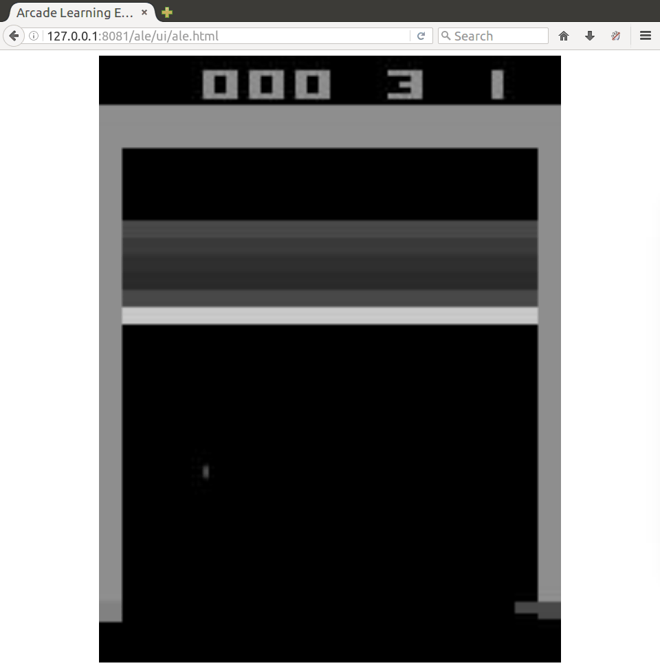

# Deep Q Learning on Arcade Learning Environment

Deep Q Learning was presented by Mnih et al. [1] to learn an AI to play Atari games. This type of reinforcement learning is supported out of the box in DIANNE. 

## Starting DIANNE runtime

Start DIANNE using the `ale.bndrun` run file in this project. This file extends the default DIANNE run configuration, complemented with `rl.*` bundles as well as the ale environment bundle.

## Creating an experience pool

The experience pools are stored in the `experience` directory. We have specified the AtariPool in the following .json file:

```
{
	"name":"AtariPool",
	"type":"MemoryExperiencePool",
	"actionDims":[6],
	"stateDims":[4, 84, 84],
	"maxSize": 10000
}
```  
There are 6 actions one can execute on the ALE environment. The state consists of 4 84x84 crops from the ALE game as specified in [1]. Depending on the memory your machine has available, you can increase the `maxSize` of your experience pool. In case memory is a limiting factor, you can also specify a `FileExperiencePool` type which will use memory-mapped files on the filesystem to store the experience samples. 


## Creating a neural network

We have provided a DQN neural network similar as described in [1]. The first hidden layer convolves 16 8x8 filters with stride 4, followed by a second hidden layer that convolves 32 4x4 filters with stride 2, each followed by a rectifier nonlinearity. Next a hidden layer is fully-connected with
256 rectifier units with a final hidden layer that ends in the 6 outputs.


## Generate experience

To generate experience, start an act job 

```
act DQN ALE AtariPool rom=roms/breakout.bin skip=4 strategy=GreedyActionStrategy epsilonMax=1.0 epsilonMin=0.1 epsilonDecay=1.0e-4 tag=dqn
```
Specify the neural network to act with, the environment to act on, and the experience pool to store the samples into. As options specify the rom to use for the ALE environment, and the skip parameter. We use the `GreedyActionStrategy` that uses epsilon greedy exploration. Also specify a `tag`, which will allow you to sync neural network weights with the learn job.

Point your browser to `http://localhost:8080/ale` to visualize the agent.




## Start training

Finally, start a learn job.

```
learn DQN,DQN AtariPool strategy=DeepQLearningStrategy batchSize=32 discount=0.95 method=RMSPROP learningRate=1.0e-6 syncInterval=10000 clean=true tag=dqn
```
Make sure to use the `DeepQLearningStrategy`, which requires two neural network instances, one for training and one for the target. Hence we specify DQN,DQN as neural networks. We use a batchsize of 32, discount factor of 0.95 and RMSPROP for updating the parameters. Each 10k steps we synchronize the neural network parameters with the repository, which will also synchronize the parameters with all agents (running with the same tag).


## Done!

Now sit back and relax. You can follow the progress in the DIANNE dashboard at `localhost:8080/dianne/dashboard`. As training proceeds you will see the Q values rise and the agent will start getting higher scores.


[[1]](https://arxiv.org/abs/1312.5602) Volodymyr Mnih, Koray Kavukcuoglu, David Silver, Alex Graves, Ioannis Antonoglou, Daan Wierstra, Martin A. Riedmiller, Playing Atari with Deep Reinforcement Learning.