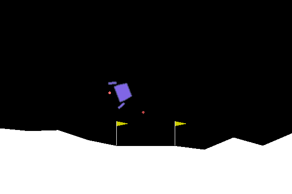

# Deep Reinforcement Learning on OpenAI Gym

In this example we will show how to run deep reinforcement learning algorithms in DIANNE with the OpenAI Gym.

## Setup

### Installing OpenAI Gym

The [OpenAI Gym](https://gym.openai.com) [1] is a Python toolkit for reinforcement learning research containing a wide range of environments to solve with an AI agent. Make sure you have Python installed on your system. We will cover the instructions for a system with Python 2.7, but it should be similar for Python 3.5.

The DIANNE OpenAI Gym environments are enabled through Java Embedded Python (JEP), a native interface enabling to call Python code from Java through CPython. Install Jep using pip:

```
pip install jep
```

Next install OpenAI Gym with the box2d environments. 
 
```
git clone https://github.com/openai/gym.git
cd gym
pip install -e .
pip install -e '.[box2d]'
```

For more detailed instructions, take a look at the [OpenAI Gym documentation](https://github.com/openai/gym#installation)
 
In order to run Jep from your OSGi runtime on Linux, make sure you have the LD_PRELOAD environment variable defined to the Python 2.7 library .so:

```
export LD_PRELOAD=/usr/lib/x86_64-linux-gnu/libpython2.7.so
```

### Starting DIANNE runtime

Start DIANNE using the `gym.bndrun` run file in this project. This file extends the default DIANNE run configuration, complemented with `rl.*` bundles as well as the gym environment bundle. You should get shell where you can interact with DIANNE using the command line:

```
g! environments
Available environments:
[1] Gym
```

### Launching an environment

Launching an environment in DIANNE is done with the `act` command. This takes the following arguments:

```
act <neural networks> <environment> <experience pool> [<key>=<value> ...]
```

* <neural-networks> is (a list of) neural network(s) that you need to translate an observation to an action, or null if no neural network is required
* <environment> is the environment to act on, in our case this is Gym
* <experience pool> the experience pool to store each <state, action, next state, reward> tuple in, which can be used for training a policy as we will discuss later
* any other properties can be provided as additional <key>=<value> pairs, most notable are:
	* strategy=<strategy> : the action strategy to use, for example RandomActionStrategy or GreedyActionStrategy
	* env=<gym env> : the Gym environment you want to load
	
For example, to launch the LunarLander environment that is available in OpenAI Gym, with a RandomActionStrategy that just takes some random actions, run:

```
act null Gym null env=LunarLander-v2 strategy=RandomActionStrategy
``` 

Now you should see a LunarLander that crashes into the void :-)



You can stop the job using the `dianne:stop` command or using the web interface pointing your browser to `localhost:8080/dianne/dashboard`.


## DQN

We will now use deep Q learning to train a neural network to control the lunar lander, using the DQN algorithm [2].

```
act DeepLunar Gym ExperiencePool env=LunarLander-v2 maxActions=500 epsilonDecay=1e-2 epsilonMin=0.1 trace=true tag=dqn
```

```
learn DeepLunar,DeepLunar ExperiencePool strategy=DeepQLearningStrategy batchSize=32 method=RMSPROP criterion=HUB learningRate=1e-4 clean=true tag=dqn
```


[[1]](https://arxiv.org/abs/1606.01540) Greg Brockman, Vicki Cheung, Ludwig Pettersson, Jonas Schneider, John Schulman, Jie Tang, Wojciech Zaremba, OpenAI Gym.

[[2]](https://arxiv.org/abs/1312.5602) Volodymyr Mnih, Koray Kavukcuoglu, David Silver, Alex Graves, Ioannis Antonoglou, Daan Wierstra, Martin A. Riedmiller, Playing Atari with Deep Reinforcement Learning.
